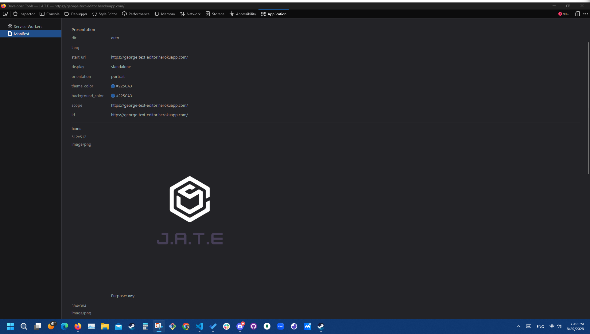

# Text Editor Starter Code

## Description
 This project is a simple text editing application in which the user can write text, have it saved onto their cache and retrieve it later. The Program is downloadable so that the user may use the application online or offline. 

## Directions

- Simply click on the live website located on this read me file. The live website is hosted on heroku. 

- When the webpage is open the user may begin editing the text however they like. 

- To download the program onto their computer, simply click the install button located on the upper left corner of the viewport. 

## Photos 

## Live Link

https://george-text-editor.herokuapp.com/

## Github Link

https://github.com/xyiorgyx/Text-Editor-PWD

## Contributers
The sole contributor to this application is xyiorgyx.

## License
https://opensource.org/licenses/MIT 

## ContactInfo

Contact me at anytime at Yiorgosbos@aol.com for questions or other inquieries. Also check out my github account at https://github.com/xyiorgyx.

Copyright (c) 2023